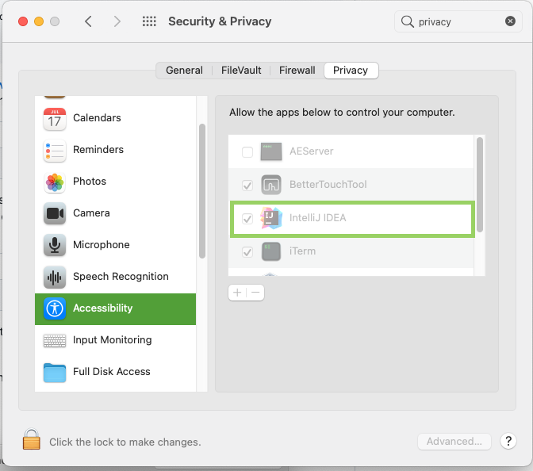

# Countdown

### Development 

#### Basic commands

```bash
./gradlew clean run # runs the application in development mode
./gradlew clean build # builds the application
./gralew clean check # runs tests
./gradlew clean assemble # creates an executable jar
```

#### How to run integration tests on MacOS through IntelliJ IDEA?
In order to run integration tests on MacOS through Intellij IDEA we 
need to allow our IDE to control the computer. We can do that in system preferences: 
```
System Preferences -> Security & Privacy -> Accesibility
```




